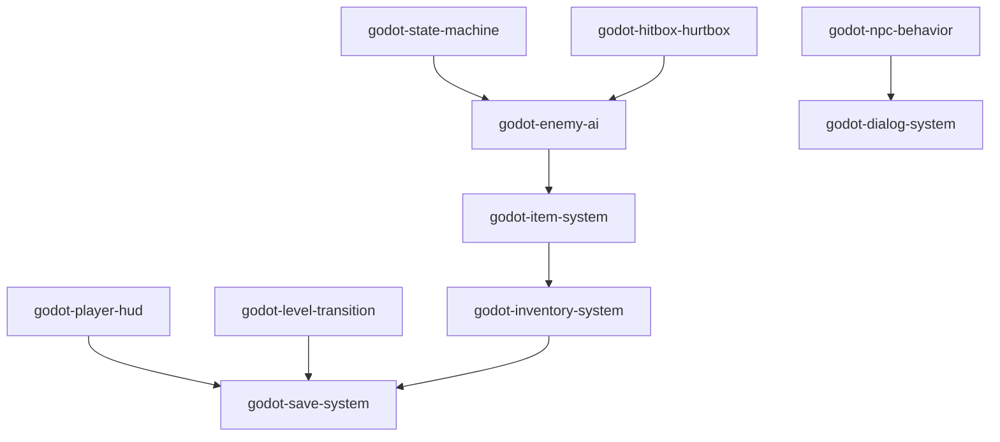

# Godot Skills for  2D Action Adventure Games

[简体中文](./README.zh-CN.md)

## Project Scope

The repository is organized around a set of systems that often appear together in Zelda-like projects:

- state-driven actor logic
- combat collision
- enemy behavior
- item and inventory systems
- HUD and game-over flow
- level transitions
- NPC behavior and dialog
- save/load and persistent world state

## Repository Contents

Each skill folder contains:

- `SKILL.md`
  A short instruction file that explains what the system is for, when it should be used, and what to watch out for.
- `references/code/`
  GDScript reference files that show one concrete implementation pattern.

You can use the repository in two ways:

1. read the folders manually as project documentation and reference code
2. point an AI coding assistant at the relevant folders if your workflow supports local skills or instruction files

## Skill Map

| Skill | Summary | Typical use cases |
| --- | --- | --- |
| [`godot-state-machine`](./godot-state-machine) | Generic finite state machine foundation for player, enemy, and NPC logic | movement states, attack states, AI states |
| [`godot-hitbox-hurtbox`](./godot-hitbox-hurtbox) | Separation between attack areas and damage receivers | melee attacks, projectiles, traps, enemy contact damage |
| [`godot-enemy-ai`](./godot-enemy-ai) | State-based enemy behavior with idle, wander, chase, stun, destroy, vision checks, and drops | field enemies, dungeon enemies, patrol enemies |
| [`godot-item-system`](./godot-item-system) | Item resources, item effects, pickups, droppers, and magnet collection | healing items, loot, chest rewards, enemy drops |
| [`godot-inventory-system`](./godot-inventory-system) | Resource-based inventory data, slots, stacking, usage, and UI refresh | pause menu inventory, consumables, pickups |
| [`godot-player-hud`](./godot-player-hud) | Heart-based health display and game-over flow | player HUD, continue/title flow |
| [`godot-level-transition`](./godot-level-transition) | Scene transitions with fade, door targets, spawn handling, and player offsets | houses, caves, dungeons, room-to-room traversal |
| [`godot-npc-behavior`](./godot-npc-behavior) | Patrol and wander behaviors for non-hostile characters | villagers, guards, ambient town movement |
| [`godot-dialog-system`](./godot-dialog-system) | NPC dialog with typewriter text, portrait animation, branching choices, and pause handling | towns, quests, story scenes, shopkeepers |
| [`godot-save-system`](./godot-save-system) | JSON save/load, persistent scene flags, player data, and inventory data | save points, continue systems, persistent world state |

## Notes by Skill

### `godot-state-machine`

Includes:

- a generic state lifecycle
- player and enemy variants
- a simple initialization pattern around child state nodes

Use when:

- actor logic is starting to become harder to manage in a single script

### `godot-hitbox-hurtbox`

Includes:

- a clear `HitBox` / `HurtBox` contract
- minimal signals for applying damage
- collision-layer guidance in the skill notes

Use when:

- attacks, enemies, and damageable actors need to share a consistent combat interface

### `godot-enemy-ai`

Includes:

- idle, wander, chase, stun, and destroy states
- vision area hooks for aggro
- damage handling, knockback, invulnerability windows, and drops

Use when:

- you want enemy behavior organized as explicit states
- the project already has, or is ready for, a state machine and combat collision setup

### `godot-item-system`

Includes:

- `ItemData` resources
- item effect resources
- pickup actors
- dropper and magnet helpers

Use when:

- enemies, chests, or map objects can spawn pickups
- items need behavior beyond a static icon

### `godot-inventory-system`

Includes:

- `InventoryData` and `SlotData` resources
- stacking and item use
- UI refresh behavior for pause-menu inventory
- save-data serialization hooks

Use when:

- items need to persist across scenes or saves
- the project has consumables or collectible resources

### `godot-player-hud`

Includes:

- heart-based health display
- game-over screen flow
- continue/title entry points

Use when:

- the project uses visible health UI and a simple continue flow

### `godot-level-transition`

Includes:

- scene fade handling
- door-to-door scene transfer
- offset calculation for player placement
- initial spawn support

Use when:

- the world is split into rooms, houses, caves, or map chunks

### `godot-npc-behavior`

Includes:

- patrol behavior
- random wander behavior
- pause/resume behavior around player interaction

Use when:

- NPCs should move through the map instead of standing still
- dialog should temporarily interrupt ambient NPC behavior

### `godot-dialog-system`

Includes:

- typewriter text with punctuation delay
- portrait blink and mouth animation
- branching choice flow through `DialogChoice` and `DialogBranch`
- game pause during active dialog

Use when:

- NPC conversations are more than a single text line
- you need towns, quests, or story interactions

### `godot-save-system`

Includes:

- JSON save structure
- scene path, player state, inventory data, and persistent flags
- a `PersistentDataHandler` pattern for one-off scene state

Use when:

- the world needs to remember opened, collected, or consumed objects
- room transitions and inventory are already defined

## How the Systems Relate



The graph is not a strict dependency list, but it reflects a common way these systems are combined in a Zelda-like project.

## Suggested Integration Order

For a new project, the following order usually keeps the least friction:

1. [`godot-state-machine`](./godot-state-machine)
2. [`godot-hitbox-hurtbox`](./godot-hitbox-hurtbox)
3. [`godot-enemy-ai`](./godot-enemy-ai)
4. [`godot-item-system`](./godot-item-system)
5. [`godot-inventory-system`](./godot-inventory-system)
6. [`godot-player-hud`](./godot-player-hud)
7. [`godot-level-transition`](./godot-level-transition)
8. [`godot-npc-behavior`](./godot-npc-behavior)
9. [`godot-dialog-system`](./godot-dialog-system)
10. [`godot-save-system`](./godot-save-system)

The main idea is to define actor logic first, then combat, then content systems, and finally persistence.

## Using the Repository

### Option A: Read It Directly

You can use the repository without installing it into any tool.

Typical workflow:

1. open the relevant skill folder
2. read `SKILL.md`
3. inspect `references/code/`
4. adapt the patterns to your project structure

### Option B: Add It to a Local Skills Directory

If your tooling supports a local skill or instruction directory, copy or symlink only the folders you need.

Example:

```bash
git clone <your-repo-url>
cd godotSkills

export SKILLS_DIR="<path-to-your-local-skills-directory>"
mkdir -p "$SKILLS_DIR"

for dir in godot-*; do
  cp -R "$dir" "$SKILLS_DIR/"
done
```

If you prefer to edit the skills in place, symlinks are usually more convenient:

```bash
git clone <your-repo-url>
cd godotSkills

export SKILLS_DIR="<path-to-your-local-skills-directory>"
mkdir -p "$SKILLS_DIR"

for dir in godot-*; do
  ln -s "$(pwd)/$dir" "$SKILLS_DIR/$dir"
done
```

### Option C: Keep the Repository in Your Workspace

If your assistant can read local files, it is often enough to keep the repository beside your game project and point it at the relevant folder.

Typical workflow:

1. keep this repository checked out locally
2. open your Godot project in the same workspace, or make both locations available
3. point the assistant to a specific folder such as `godot-enemy-ai/` or `godot-dialog-system/`
4. ask it to use `SKILL.md` and `references/code/` as implementation reference

### Prompting Pattern

With most assistants, the triggering pattern is straightforward:

- name the system directly
- mention the skill folder if needed
- give the assistant access to your project structure before asking it to adapt the code

Example prompts:

```text
Use godot-state-machine and godot-hitbox-hurtbox as reference and adapt them to my current player and enemy scenes.
```

```text
Read godot-enemy-ai and build a slime enemy that fits my existing scene tree.
```

```text
Use godot-item-system, godot-inventory-system, and godot-save-system as reference and wire them into my current pause menu and player data.
```

## Project Assumptions and Limitations

The reference code comes from a concrete project context, so some files assume project-level managers or scene conventions such as:

- `GlobalPlayerManager`
- `GlobalLevelManager`
- `GlobalSaveManager`
- `GlobalAudioManager`
- `PauseMenu`

The code also assumes:

- Godot 4-style APIs
- specific input actions in some systems
- autoload usage for several managers
- node names and scene trees that may differ from your project

The repository is intended as reusable structure and reference material, not as a zero-edit drop-in package.

## Repository Structure

```text
godotSkills/
├── godot-state-machine/
│   ├── SKILL.md
│   └── references/code/
├── godot-hitbox-hurtbox/
│   ├── SKILL.md
│   └── references/code/
├── godot-enemy-ai/
│   ├── SKILL.md
│   └── references/code/
├── godot-item-system/
│   ├── SKILL.md
│   └── references/code/
├── godot-inventory-system/
│   ├── SKILL.md
│   └── references/code/
├── godot-player-hud/
│   ├── SKILL.md
│   └── references/code/
├── godot-level-transition/
│   ├── SKILL.md
│   └── references/code/
├── godot-npc-behavior/
│   ├── SKILL.md
│   └── references/code/
├── godot-dialog-system/
│   ├── SKILL.md
│   └── references/code/
├── godot-save-system/
│   ├── SKILL.md
│   └── references/code/
├── README.md
└── README.zh-CN.md
```
