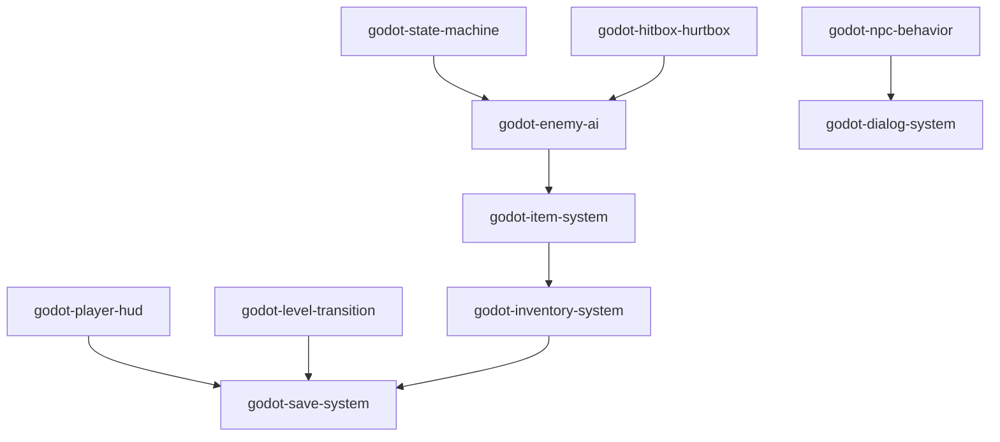

# Godot 类 2D动作探索游戏 Skills

[English](./README.md)

## 项目定位

仓库围绕的是类塞尔达项目里经常一起出现的一组系统：

- 基于状态的角色逻辑
- 战斗判定
- 敌人行为
- 物品与背包
- HUD 与死亡流程
- 场景切换
- NPC 行为与对话
- 存档、读档和世界持久化

## 仓库内容

每个 skill 文件夹里主要有两部分：

- `SKILL.md`
  一个简短的说明文件，介绍这个系统适合解决什么问题、何时使用、有哪些关键约束。
- `references/code/`
  对应的 GDScript 参考实现，用来展示一种具体的落地方式。

这个仓库的常见使用方式有两种：

1. 直接手动阅读，作为项目参考资料
2. 在支持本地 skill 或 instruction 文件的工作流里，按需让助手读取相关目录

## Skills 一览

| Skill | 内容摘要 | 典型应用场景 |
| --- | --- | --- |
| [`godot-state-machine`](./godot-state-machine) | 通用有限状态机骨架，适合玩家、敌人和 NPC | 角色状态、攻击状态、AI 状态 |
| [`godot-hitbox-hurtbox`](./godot-hitbox-hurtbox) | 攻击区域和受击区域分离 | 近战、投射物、陷阱、碰撞伤害 |
| [`godot-enemy-ai`](./godot-enemy-ai) | 基于状态机的敌人行为，包含闲置、徘徊、追击、眩晕、死亡和掉落 | 野怪、地牢敌人、巡逻敌人 |
| [`godot-item-system`](./godot-item-system) | 物品资源、物品效果、拾取物、掉落器、吸附收集 | 红心、药水、战利品、宝箱奖励、敌人掉落 |
| [`godot-inventory-system`](./godot-inventory-system) | 资源化背包数据、槽位、堆叠、使用和 UI 刷新 | 暂停菜单、消耗品、收集物管理 |
| [`godot-player-hud`](./godot-player-hud) | 心形血量显示和游戏结束流程 | 玩家 HUD、继续游戏、返回标题 |
| [`godot-level-transition`](./godot-level-transition) | 场景切换、淡入淡出、目标门定位、出生点和位置偏移 | 房屋、洞穴、地牢、房间切换 |
| [`godot-npc-behavior`](./godot-npc-behavior) | NPC 巡逻和徘徊行为 | 村民、守卫、环境 NPC |
| [`godot-dialog-system`](./godot-dialog-system) | NPC 对话、打字机文本、头像动画、分支选择、暂停处理 | 村庄对话、任务对话、剧情、商店 |
| [`godot-save-system`](./godot-save-system) | JSON 存档、读档、持久化标记、玩家数据和背包数据 | 存档点、继续游戏、世界状态保存 |

## 各 Skill 说明

### `godot-state-machine`

包含：

- 通用状态生命周期
- 玩家和敌人的状态机变体
- 通过子节点组织状态的初始化方式

适用场景：

- 角色逻辑开始难以在单脚本里维护

### `godot-hitbox-hurtbox`

包含：

- `HitBox` / `HurtBox` 的基础约定
- 受击信号与伤害传递
- 相关碰撞层配置说明

适用场景：

- 武器、敌人、陷阱、技能需要共享统一的战斗接口

### `godot-enemy-ai`

包含：

- Idle、Wander、Chase、Stun、Destroy 状态
- 视野检测与仇恨切换
- 受击、击退、无敌时间和掉落

适用场景：

- 敌人逻辑已经不适合继续塞进一个大脚本
- 项目已经有，或者准备接入，状态机和战斗判定系统

### `godot-item-system`

包含：

- `ItemData` 资源
- 物品效果资源
- 可拾取物
- 掉落器和吸附收集辅助节点

适用场景：

- 敌人、宝箱、场景物件会生成拾取物
- 物品除了显示图标之外还需要具体效果

### `godot-inventory-system`

包含：

- `InventoryData` 和 `SlotData`
- 物品堆叠和使用
- 暂停菜单式背包 UI 刷新
- 存档数据转换接口

适用场景：

- 物品需要跨场景或跨存档保存
- 项目中有消耗品或持续收集型道具

### `godot-player-hud`

包含：

- 心形血量显示
- 游戏结束界面
- 继续游戏 / 返回标题入口

适用场景：

- 项目需要可见生命值 UI 和基础死亡流程

### `godot-level-transition`

包含：

- 淡入淡出切换
- 门到门的场景传送
- 玩家偏移修正
- 初始出生点支持

适用场景：

- 世界由房间、建筑、洞穴、地图分块组成

### `godot-npc-behavior`

包含：

- 巡逻行为
- 随机徘徊
- 与玩家交互前后的暂停和恢复

适用场景：

- NPC 需要在地图里活动，而不是固定站桩
- 对话发生时需要临时中断环境行为

### `godot-dialog-system`

包含：

- 打字机效果和标点停顿
- 头像眨眼与张嘴动画
- `DialogChoice` / `DialogBranch` 分支结构
- 对话期间暂停游戏

适用场景：

- 需要多句对话而不是单条文本提示
- 村庄、任务、剧情和商店场景

### `godot-save-system`

包含：

- JSON 存档结构
- 场景路径、玩家状态、背包数据和持久化标记
- `PersistentDataHandler` 这种一次性场景状态处理方式

适用场景：

- 需要记住哪些物体已经被拾取、开启或触发
- 场景切换和背包结构已经基本确定

## 系统关系



这张图不是严格意义上的依赖清单，但基本反映了这些系统在类塞尔达项目里常见的组合方式。

## 建议接入顺序

如果是一个新的项目，通常可以按这个顺序接入：

1. [`godot-state-machine`](./godot-state-machine)
2. [`godot-hitbox-hurtbox`](./godot-hitbox-hurtbox)
3. [`godot-enemy-ai`](./godot-enemy-ai)
4. [`godot-item-system`](./godot-item-system)
5. [`godot-inventory-system`](./godot-inventory-system)
6. [`godot-player-hud`](./godot-player-hud)
7. [`godot-level-transition`](./godot-level-transition)
8. [`godot-npc-behavior`](./godot-npc-behavior)
9. [`godot-dialog-system`](./godot-dialog-system)
10. [`godot-save-system`](./godot-save-system)

核心思路是先把角色逻辑和战斗边界定清，再补内容系统，最后处理持久化。

## 如何使用这个仓库

### 方式 A：直接阅读

不安装到任何工具里也可以使用。

常见流程：

1. 打开需要的 skill 文件夹
2. 阅读 `SKILL.md`
3. 查看 `references/code/`
4. 根据自己项目的结构做改造

### 方式 B：加入本地 Skills 目录

如果你的工具支持本地 skill 或 instruction 目录，可以只复制或软链接需要的文件夹。

示例：

```bash
git clone <your-repo-url>
cd godotSkills

export SKILLS_DIR="<path-to-your-local-skills-directory>"
mkdir -p "$SKILLS_DIR"

for dir in godot-*; do
  cp -R "$dir" "$SKILLS_DIR/"
done
```

如果希望继续在原仓库里维护这些 skill，通常软链接更方便：

```bash
git clone <your-repo-url>
cd godotSkills

export SKILLS_DIR="<path-to-your-local-skills-directory>"
mkdir -p "$SKILLS_DIR"

for dir in godot-*; do
  ln -s "$(pwd)/$dir" "$SKILLS_DIR/$dir"
done
```

### 方式 C：把仓库放在工作区里

如果你的助手可以读取本地文件，很多时候只需要把这个仓库放在游戏项目旁边，并让它读取对应目录。

常见流程：

1. 把这个仓库保留在本地
2. 在同一个工作区里打开你的 Godot 项目，或者保证两边目录都可访问
3. 让助手读取某个具体目录，比如 `godot-enemy-ai/` 或 `godot-dialog-system/`
4. 让它把 `SKILL.md` 和 `references/code/` 作为实现参考

### 提示词使用方式

对于大多数助手，触发方式都比较直接：

- 直接说系统名字
- 必要时点名 skill 文件夹
- 在让它改代码之前，先让它看到你的项目结构

示例：

```text
使用 godot-state-machine 和 godot-hitbox-hurtbox 作为参考，适配到我现有的玩家和敌人场景里。
```

```text
读取 godot-enemy-ai，然后帮我做一个符合当前场景树结构的史莱姆敌人。
```

```text
把 godot-item-system、godot-inventory-system 和 godot-save-system 作为参考，接到我现有的暂停菜单和玩家数据结构里。
```

## 当前实现的假设与限制

这些参考代码来自一个具体项目环境，所以部分脚本会默认存在一些项目级管理器或场景约定，例如：

- `GlobalPlayerManager`
- `GlobalLevelManager`
- `GlobalSaveManager`
- `GlobalAudioManager`
- `PauseMenu`

同时也默认了：

- Godot 4 风格 API
- 某些输入动作名
- 若干 autoload
- 某些节点命名和场景树结构

这个仓库的目标是提供可复用结构和参考实现，而不是零改动直接导入的完整成品。

## 仓库结构

```text
godotSkills/
├── godot-state-machine/
│   ├── SKILL.md
│   └── references/code/
├── godot-hitbox-hurtbox/
│   ├── SKILL.md
│   └── references/code/
├── godot-enemy-ai/
│   ├── SKILL.md
│   └── references/code/
├── godot-item-system/
│   ├── SKILL.md
│   └── references/code/
├── godot-inventory-system/
│   ├── SKILL.md
│   └── references/code/
├── godot-player-hud/
│   ├── SKILL.md
│   └── references/code/
├── godot-level-transition/
│   ├── SKILL.md
│   └── references/code/
├── godot-npc-behavior/
│   ├── SKILL.md
│   └── references/code/
├── godot-dialog-system/
│   ├── SKILL.md
│   └── references/code/
├── godot-save-system/
│   ├── SKILL.md
│   └── references/code/
├── README.md
└── README.zh-CN.md
```
