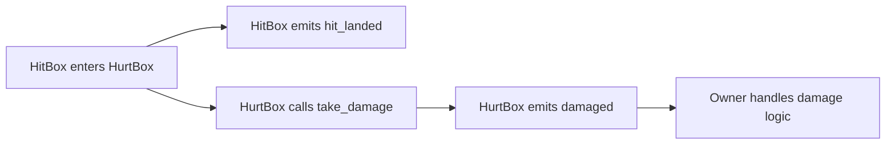

# HitBox/HurtBox Combat Collision System

Reusable components for attack detection and damage reception in 2D action games.

## Core Concepts

| Component | Description | Purpose |
| ----------------- | -------- | ---------------------------------- |
| **HitBox**  | Attack area | Attach to an attack source such as a weapon or skill effect |
| **HurtBox** | Damage receiver | Attach to an object that can be damaged, such as the player or an enemy |



## Quick Integration

### 1. Copy the files into your project

Recommended location: `GeneralNode/`

```
GeneralNode/
├── HitBox/
│   ├── hit_box.gd
│   └── HitBox.tscn
└── HurtBox/
    ├── hurt_box.gd
    └── HurtBox.tscn
```

### 2. Configure collision layers

In `Project > Project Settings > Layer Names > 2D Physics`, set something like:

| Layer | Suggested name | Purpose |
| ------- | ---------- | ------------ |
| Layer 2 | PlayerHurt | Player damage receiver |
| Layer 9 | EnemyHurt  | Enemy damage receiver |

### 3. Configure the scenes

**HitBox (attack area)**:

- `collision_layer`: `0` (not detected as a target)
- `collision_mask`: set to the target layers you want to hit, for example `PlayerHurt = 2` or `EnemyHurt = 256`
- `monitorable`: `false`

**HurtBox (damage receiver)**:

- `collision_layer`: set to the layer that should be hittable, for example `EnemyHurt = 256`
- `collision_mask`: `0` (does not actively detect)
- `monitoring`: `false`

### 4. Usage example

```gdscript
# Connect the HurtBox signal in the enemy script
@onready var hurt_box: HurtBox = $HurtBox

func _ready() -> void:
    hurt_box.damaged.connect(_on_damaged)

func _on_damaged(hit_box: HitBox) -> void:
    hp -= hit_box.damage
    if hp <= 0:
        queue_free()
```

## Script Reference

### `hit_box.gd` (attack area)

```gdscript
class_name HitBox extends Area2D

signal hit_landed  # Emitted when an attack connects

@export var damage: int = 1  # Damage value

func _ready() -> void:
    area_entered.connect(_area_entered)

func _area_entered(area: Area2D) -> void:
    if area is HurtBox:
        hit_landed.emit()
        area.take_damage(self)
```

### `hurt_box.gd` (damage receiver)

```gdscript
class_name HurtBox extends Area2D

signal damaged(hit_box: HitBox)  # Emitted when damage is received

func take_damage(hit_box: HitBox) -> void:
    damaged.emit(hit_box)
```

## FAQ

**Q: My attacks are not dealing damage. What should I check?**

- Make sure the HitBox `collision_mask` includes the HurtBox `collision_layer`.
- Make sure the HurtBox has a `CollisionShape2D` child.

**Q: How can I add invulnerability frames?**

- Add an `invulnerable` variable to the owning object and check it inside `_on_damaged`.

## Code Files

See the full implementation in `references/code/`.

> [!NOTE]
> In the original project, the HitBox and HurtBox names were reversed. This skill uses the standard naming:
>
> - **HitBox** = attack area (deals damage)
> - **HurtBox** = damage receiver (takes damage)
