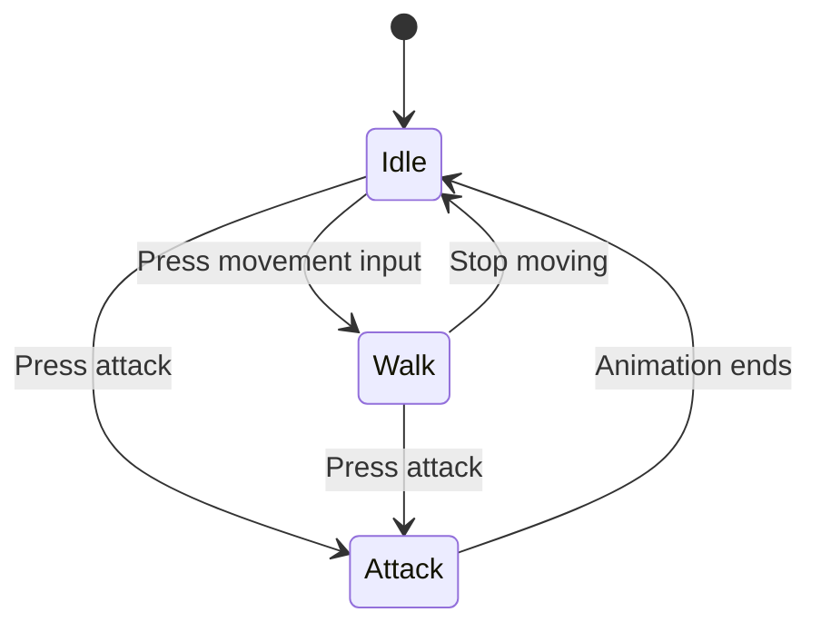

# State Machine System

A generic finite state machine framework for player control, enemy AI, NPC behavior, and similar systems.

## Core Concepts



| Component | Description |
|------|------|
| **State** | Base state class that defines lifecycle methods such as `enter`, `exit`, and `process` |
| **StateMachine** | State machine manager responsible for switching states and forwarding lifecycle calls |

## Quick Integration

### 1. Copy the core files

```
Player/Scripts/
├── state.gd                  # Player base state class
├── player_state_machine.gd   # Player state machine
├── state_idle.gd             # Example idle state
└── state_walk.gd             # Example walk state

# Or the enemy version
Enemies/Scripts/
├── enemy_state.gd            # Enemy base state class
└── enemy_state_machine.gd    # Enemy state machine
```

### 2. Scene tree structure

```
Player (CharacterBody2D)
├── StateMachine (PlayerStateMachine)
│   ├── StateIdle (State)
│   ├── StateWalk (State)
│   └── StateAttack (State)
└── ...
```

### 3. Initialize the state machine

```gdscript
# In the Player script
@onready var state_machine: PlayerStateMachine = $StateMachine

func _ready() -> void:
    state_machine.initialize(self)
```

### 4. Create a new state

```gdscript
class_name StateIdle extends State

func enter() -> void:
    player.update_animation("idle")

func process(_delta: float) -> State:
    # Check input and switch states
    if player.direction != Vector2.ZERO:
        return state_machine.states[1]  # Switch to Walk
    return null  # Stay in the current state

func physics_process(_delta: float) -> State:
    player.velocity = Vector2.ZERO
    return null
```

## State Lifecycle

| Method | When it runs | Purpose |
|------|----------|------|
| `init()` | When the state machine is initialized | One-time setup |
| `enter()` | When entering the state | Start animations, reset variables |
| `exit()` | When leaving the state | Cleanup |
| `process(delta)` | Every frame in `_process` | Logic update; return a new state to switch |
| `physics_process(delta)` | Every frame in `_physics_process` | Physics update |
| `handle_input(event)` | In `_unhandled_input` (player only) | Input handling |

## Player vs Enemy State Machines

| Feature | PlayerStateMachine | EnemyStateMachine |
|------|-------------------|-------------------|
| Input handling | Yes, `handle_input` | No |
| Shared references | Static `player` / `state_machine` | Instance variables |
| `next_state` | Yes | No |

## FAQ

**Q: State changes are not working. What should I check?**
- Make sure the state's `process()` method returns a new state instance.
- Do not return `self`; return `null` to stay in the current state.

**Q: How do I get a reference to another state?**
```gdscript
# Method 1: Access by index (if you know the order)
return state_machine.states[0]

# Method 2: Find by type
for s in state_machine.states:
    if s is StateAttack:
        return s
```

## Code Files

See the full implementation in `references/code/`:
- `state.gd` - Player base state class
- `player_state_machine.gd` - Player state machine
- `enemy_state.gd` - Enemy base state class
- `enemy_state_machine.gd` - Enemy state machine
